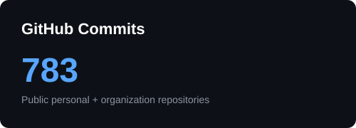
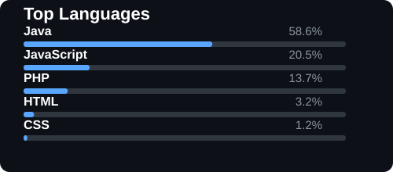

## 🖥️ Tech Stack

### 🔹 Language

### 🔹 Framework & Library

### 🔹 Database & Infra

### 🔹 Tools

## 🚀 Projects
<table>
  <tr>
    <td width="50%" valign="top">
      <b>🎫 6pm · 2026</b> 
      팬덤 SNS와 선착순 티켓팅을 결합한 Kafka 기반 MSA 플랫폼  
      <!-- Tech Badges -->
      
      
      
      
      
      
      
      
      
      
        
      <!-- Core Contributions -->
      <b>⚡ Core Contributions</b> 
      
        • 피드 도메인 아키텍처 전반 설계 
        • 게시글/댓글/좋아요 관리 API 구현 
        • 팔로워 규모별 피드 팬아웃 구현 
        • Outbox 패턴 기반 게시글 생성 이벤트 발행 
       
      
    </td>
    <td width="50%" valign="top">
      <b>📦 LogiBox · 2026</b> 
      물류 허브 네트워크 기반의 MSA 배송 관리 시스템  
      <!-- Tech Badges -->
      
      
      
      
      
      
      
      
      
      
      
        
      <!-- Core Contributions -->
      <b>⚡ Core Contributions</b> 
      
        • CI 및 Docker Compose 환경 구축 
        • 업체 및 상품 도메인 아키텍처 전반 설계 
        • 파사드 패턴 기반 업체 및 상품 관리 API 구현 
        • 비관적 락 및 Redis 기반 동시성 제어 구현 
       
      
    </td>
  </tr>
  <tr>
    <td width="50%" valign="top">
      <b>🍚 오늘한끼 · 2026</b> 
      주문부터 결제까지 처리하는 통합 배달 플랫폼  
      <!-- Tech Badges -->
      
      
      
      
      
      
      
        
      <!-- Core Contributions -->
      <b>⚡ Core Contributions</b> 
      
        • 인증 및 사용자 도메인 아키텍처 전반 설계 
        • JWT 및 Refresh Token 인증 구조 구축 
        • 이메일 인증 기반 회원가입 및 사용자 관리 API 구현 
        • 역할 기반 접근 제어 구현 
       
      
    </td>
    <td width="50%" valign="top">
      <b>🏆 FLOTI · 2025 ~</b> 
      성향 분석과 커뮤니티를 결합한 목표 달성 앱  
      <!-- Tech Badges -->
      
       
      
      
      
      
      
      
      
        
      <!-- Core Contributions -->
      <b>⚡ Core Contributions</b> 
      
        • 프로젝트 기획 및 시스템 설계 
        • 커뮤니티 관리 풀스택 구현 — TIP, QnA, 토론 게시판 
        • WebSocket 기반 토론 게시판 실시간 채팅 구현 
        • 프로젝트 전반 공통 컴포넌트 개발 
       
      
    </td>
  </tr>
  <tr>
    <td width="50%" valign="top">
      <b>🌺 생화 24 · 2025</b> 
      화훼 도·소매업자를 위한 B2B 거래 플랫폼  
      <!-- Tech Badges -->
      
       
       
       
      
      
       
      
      
        
      <!-- Core Contributions -->
      <b>⚡ Core Contributions</b> 
      
        • 프로젝트 기능 정의 및 DB 설계 
        • 공통 레이아웃 구현 — Header, Sidebar 
        • 사용자/고객센터 관리 및 상품 검색 풀스택 구현 
        • Chart.js 기반 시세 데이터 시각화 풀스택 구현 
       
      
    </td>
    <td width="50%" valign="top">
      <b>🌿 채식 어디 · 2024</b> 
      채식 유형별 제품 판독 및 맞춤형 제품 추천 서비스  
      <!-- Tech Badges -->
      
      
       
       
       
      
      
       
        
      <!-- Core Contributions -->
      <b>⚡ Core Contributions</b> 
      
        • 원재료 데이터 정제 — 27,000건의 데이터셋 확보 
        • 인증 및 제품 조회·등록·판독 API 구현 
        • OCR 데이터 기반 제품 판독 구현 
        • 판독 데이터 및 키워드 기반 제품 추천 구현 
       
      
    </td>
  </tr>
</table>

## 📊 GitHub Stats

  
  

